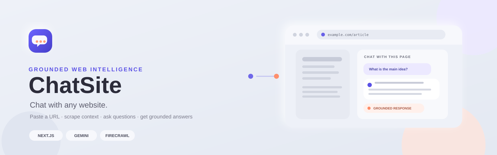
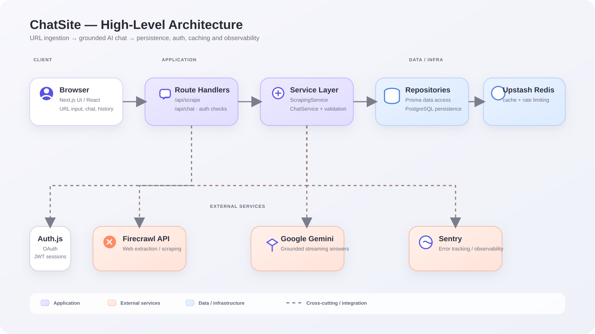

<p align="center">
  
</p>

# ChatSite — Chat With Any Website

**Paste a URL. Ask questions. Get answers grounded in the page content.**

[](https://github.com/Zephyrex21/chatsite-ai/actions/workflows/ci.yml)
[](docs/case-study.md#testing-philosophy)
[](docs/case-study.md#testing-philosophy)
[](#)

**[Read the case study →](docs/case-study.md)**

## Overview

ChatSite turns a public webpage into a conversational knowledge source.

The application:
- validates and normalizes the submitted URL
- extracts page content through Firecrawl
- caches scraped content in PostgreSQL
- builds grounded prompts for Google Gemini
- streams responses and persists conversation history
- supports guest mode, OAuth, rate limiting, sharing and Markdown export
- includes SSRF protections, structured logging and Sentry observability

## Architecture

<p align="center">
  
</p>

For the detailed layer breakdown, see [`docs/architecture.md`](docs/architecture.md).

## Tech Stack

| Layer | Technologies |
| --- | --- |
| Application | Next.js 16, React 19, TypeScript, Tailwind CSS 4 |
| AI | Google Gemini |
| Web extraction | Firecrawl |
| Data | PostgreSQL, Prisma 7 |
| Auth | Auth.js v5, GitHub / Google OAuth |
| Caching / rate limiting | Upstash Redis |
| Observability | Sentry, Vercel Analytics, Speed Insights |
| Testing | Vitest, MSW, Playwright, axe-core |
| CI | GitHub Actions, Husky, lint-staged |

## Getting Started

### Prerequisites

- Node.js 20+
- PostgreSQL
- API credentials required by the enabled integrations

### Setup

```bash
npm install
cp .env.example .env.local

npx prisma generate
npx prisma migrate dev --name init

npm run dev
```

Then open `http://localhost:3000`.

For OAuth, Redis, Sentry and deployment configuration, see the project documentation in `docs/`.

## Verification

```bash
npm run verify
```

This runs linting, type checking, formatting checks and the test suite.

Current test coverage is **98%+**, with **101 tests** across unit, integration and E2E coverage.

## Repository Structure

```text
src/
├── app/            # Next.js pages, layouts and API routes
├── components/     # UI and chat components
├── lib/
│   ├── services/   # Scraping + chat business logic
│   ├── repositories/ # Database access
│   ├── ai/         # Gemini client + prompt building
│   ├── validation/ # URL / input validation
│   └── rate-limit/ # Upstash rate limiting
└── types/

tests/
├── unit/
├── integration/
└── e2e/

docs/
├── architecture.md
├── adr-0001-tech-stack.md
├── security-checklist.md
└── case-study.md

prisma/
└── schema.prisma
```

## Project Status

**All 10 planned phases are complete.**

The project includes architecture and CI foundations, scraping and caching, grounded AI chat, authentication, UI, session history, sharing/export, security hardening, observability, testing and documentation.

## Documentation

- [Architecture](docs/architecture.md)
- [Tech Stack ADR](docs/adr-0001-tech-stack.md)
- [Security Checklist](docs/security-checklist.md)
- [Case Study](docs/case-study.md)
- [Demo Video Script](docs/demo-video-script.md)

---

<p align="center">
  Built as a production-shaped portfolio project.
</p>
