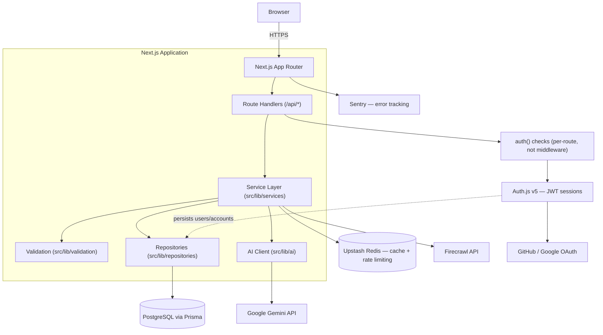

# Architecture Overview

## System diagram

## Layer responsibilities

| Layer          | Location                  | Responsibility                                                             | Framework-dependent?                         |
| -------------- | ------------------------- | -------------------------------------------------------------------------- | -------------------------------------------- |
| Route Handlers | `src/app/api/**/route.ts` | Parse request, call a service, shape the HTTP response. No business logic. | Yes (Next.js)                                |
| Services       | `src/lib/services/*`      | Business logic: scrape-or-cache, build a chat turn, enforce rate limits.   | No — pure TS, unit-testable in isolation     |
| Validation     | `src/lib/validation/*`    | Input validation/normalization (e.g. URL safety checks).                   | No                                           |
| Repositories   | `src/lib/repositories/*`  | All database access via Prisma. Services never import Prisma directly.     | No (Prisma is a dependency, not a framework) |
| AI client      | `src/lib/ai/*`            | Gemini API calls, prompt templates, fallback-chain logic.                  | No                                           |
| Components     | `src/components/*`        | UI only. No data-fetching business logic beyond calling a route.           | Yes (React/Next.js)                          |

The rule that keeps this testable: **anything under `src/lib` must never
import from `next/*` or `src/app`.** If a service needs something
Next.js-specific (like reading a cookie), that value is passed in as a
parameter from the route handler, not fetched internally by the service.

## Request flow example: asking a question

1. User submits a question in the chat UI (`src/components/chat`)
2. Client calls `POST /api/chat` (Route Handler)
3. Route Handler validates the request shape, extracts the authenticated
   user (if any) via NextAuth, and calls `chatService.ask(...)`
4. `chatService` (in `src/lib/services`):
   - Fetches the session + message history via `chatRepository`
   - Builds the grounded prompt via `src/lib/ai/prompt.ts`
   - Calls Gemini via `src/lib/ai/gemini.ts` (with fallback chain)
   - Persists the new message pair via `chatRepository`
5. Route Handler streams the response back to the client

Every step from 4 onward is unit/integration-testable without a running
Next.js server, because none of it imports `next/*`.
